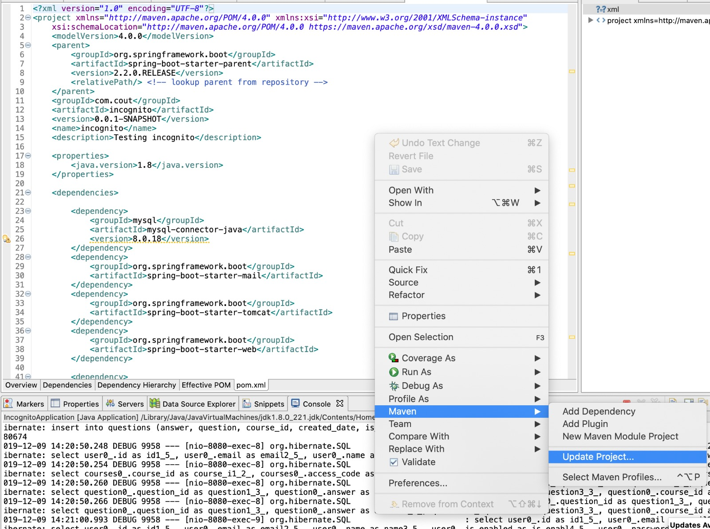

1) Clone the repo
2) Open the project in eclipse 
3) Under Package explorer, go to pom.xml and update the dependancies in the file



4) Then right click on the file and then select maven-->Update Project


Select ok


5) Under Package explorer, select com.cout.igcognito and then open IcognitoApplication.java


6) Then right click on the file and then run as Java application


7) Go to your web broswer, and type in your address bar the following:

```bash
http://localhost:8080/
```

